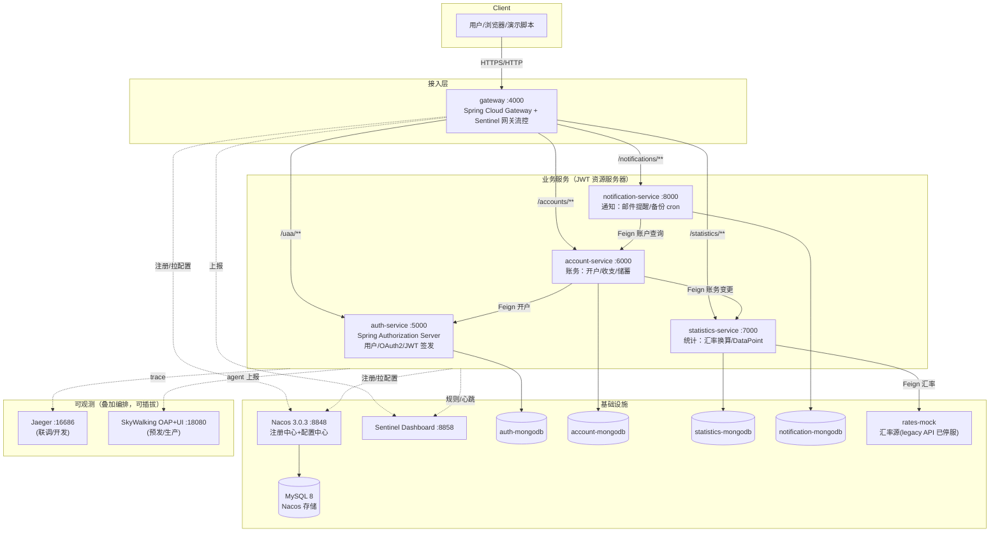

# Piggymetrics Refactored — 金融级 Spring Cloud Alibaba 微服务重构工程


> 将经典微服务教学项目 **Piggymetrics**（Spring Cloud Netflix / Boot 2.0.3 / JDK 8）按**银行金融生产标准**整体重构为 **Spring Cloud Alibaba 现代技术栈**的完整示范工程：注册/配置中心 Nacos 3.0.3、熔断限流 Sentinel、JWT 无状态鉴权（Spring Authorization Server）、分布式链路追踪（Jaeger 联调 / SkyWalking 生产）、全容器化部署，并附带金融级分阶段交付流程（审计 → 重构 → 测试用例 → 测试执行 → 文档）的完整过程资产。

**核心承诺**：账务/金额/鉴权等金融红线区域只做**等价迁移、零业务改动**；金额计算语义（BigDecimal scale=4 / HALF_UP、汇率换算）以黄金数据测试逐分锁定；所有变更可回滚。

---

## 目录

- [技术栈（旧 → 新）](#技术栈旧--新)
- [系统架构](#系统架构)
- [模块说明](#模块说明)
- [仓库目录结构](#仓库目录结构)
- [业务接口](#业务接口)
- [快速开始（部署演示）](#快速开始部署演示)
- [链路追踪](#链路追踪)
- [熔断 / 限流 / 降级（Sentinel）](#熔断--限流--降级sentinel)
- [测试与质量验证](#测试与质量验证)
- [Nacos 配置中心](#nacos-配置中心)
- [过程文档索引](#过程文档索引)
- [已知限制](#已知限制)

---

## 技术栈（旧 → 新）

| 能力域 | 旧栈（Netflix，已 EOL） | 新栈（本工程） |
|---|---|---|
| JDK | 8 | **17** |
| 基础框架 | Spring Boot 2.0.3 / Cloud Finchley | **Spring Boot 3.5.3 / Cloud 2025.0.0** |
| 微服务套件 | Spring Cloud Netflix | **Spring Cloud Alibaba 2025.0.0.0** |
| 注册中心 | Eureka | **Nacos 3.0.3**（discovery） |
| 配置中心 | Spring Cloud Config + Bus/AMQP | **Nacos 3.0.3**（config，`spring.config.import` 方式，去 bootstrap.yml） |
| 网关 | Zuul 1 | **Spring Cloud Gateway**（WebFlux） |
| 熔断/限流 | Hystrix + Turbine | **Sentinel**（Dashboard + 网关流控 + Feign fallback） |
| 鉴权 | spring-security-oauth2（有状态会话） | **Spring Authorization Server + JWT 无状态**（保留 legacy password grant 等价兼容） |
| 链路追踪 | Sleuth + Zipkin | **Micrometer Tracing**（联调：Jaeger / 生产：SkyWalking Java Agent） |
| 服务调用 | Feign + Ribbon | **OpenFeign + Spring Cloud LoadBalancer**（含 feign-micrometer 跨服务 trace 传播） |
| 数据库 | MongoDB 3.x | **MongoDB 4.4**（每服务独立库，wire-compat 零数据迁移） |
| 部署 | 裸 jar | **Docker Compose 全容器化**（12+ 容器一键起） |

## 系统架构



**请求主链路（开户为例）**：
`POST /accounts/` → gateway（鉴权豁免路由）→ account-service（创建账务文档）→ Feign → auth-service `POST /users`（BCrypt 存储用户）→ 返回。
**账务变更链路**：`PUT /accounts/current`（Bearer JWT）→ account-service → Feign → statistics-service（汇率换算生成 DataPoint，BigDecimal 精度锁定）。

## 模块说明

| 模块 | 端口 | 职责 | 关键点 |
|---|---|---|---|
| `gateway` | 4000 | 统一入口、路由转发、Sentinel 网关流控 | Zuul 路由 1:1 等价迁移（stripPrefix 语义、ignoredServices 等价） |
| `auth-service` | 5000 | 用户管理、OAuth2 授权、JWT 签发/校验 | SAS 自定义 password grant + client_id-only(NONE) 客户端认证，legacy 行为等价 |
| `account-service` | 6000 | 账务核心：开户、查询、收支/储蓄变更 | **金融红线区**：仅等价迁移；`@PreAuthorize` 域校验保留（SCOPE_server / demo） |
| `statistics-service` | 7000 | 统计聚合、汇率换算、DataPoint 持久化 | **金融红线区**：金额精度 scale=4/HALF_UP 黄金数据锁定；fallback 降级保可用性 |
| `notification-service` | 8000 | 邮件提醒、收件人设置、备份 cron | `@Scheduled` cron 由 Nacos 配置驱动 |

支撑目录：`nacos-config/`（配置模板+同步脚本）、`skywalking/`（告警规则+OAP 外挂驱动）、`integration-test/`（IT 编排+联调验证脚本）、`mongodb/dump`（初始化数据）、`init/`（Nacos 初始化）。

## 仓库目录结构

```
piggymetrics-refactored/
├── pom.xml                          # 聚合父 POM（BOM 统一版本，5 module）
├── gateway/                         # Spring Cloud Gateway + Sentinel 网关流控
├── auth-service/                    # Spring Authorization Server（用户/JWT/legacy grant 兼容）
├── account-service/                 # 账务核心（金融红线区）
├── statistics-service/              # 统计与汇率换算（金融红线区）
├── notification-service/            # 邮件通知/备份 cron
├── docker-compose.yml               # 主编排：12 容器（Nacos/MySQL/Sentinel/4×Mongo/5×服务）
├── docker-compose.override.yml      # macOS 端口适配（AirPlay 占用 5000/7000 时重映射）
├── docker-compose.tracing.yml       # 叠加：Jaeger（联调链路追踪，方案B）
├── docker-compose.skywalking.yml    # 叠加：SkyWalking OAP/UI/Agent（预发/生产，方案C）
├── nacos-config/                    # Nacos 配置模板 + 同步脚本（sync-to-nacos.py）
├── skywalking/                      # 告警规则 alarm-settings.yml + OAP 外挂 JDBC 驱动
├── integration-test/                # IT 编排、rates-mock、31 断言联调脚本
├── mongodb/                         # Mongo 初始化 dump（demo 账户/黄金数据基线）
├── docs/                            # ★ 全套分阶段交付过程文档（审计→重构→测试→部署→追踪）+ docs/dp/ 测试用例设计
├── verify-main-compose.py           # 全链路 31 项自动化断言
├── verify-skywalking.py             # SkyWalking 7 项验证
├── stress-gateway.py                # 网关四阶段压测（基线/限流/降级/traceId）
├── provision-main-nacos.py          # Nacos namespace/config 一键初始化
└── sw-generate-traffic.py           # 认证流量生成器（演示/验证用）
```

## 业务接口

所有接口经网关 `http://localhost:4000` 暴露；除开户/令牌外均需 `Authorization: Bearer <token>`（scope=`ui`）。

### 认证与用户（→ auth-service）

| 方法 | 路径 | 说明 | 鉴权 |
|---|---|---|---|
| POST | `/uaa/oauth2/token` | 获取令牌：`grant_type=password&client_id=browser&username=..&password=demo12345&scope=ui`；服务间用 `client_credentials` | Basic/公开客户端 |
| GET | `/uaa/users/current` | 当前登录用户信息 | Bearer |
| POST | `/uaa/users` | 创建用户（BCrypt 存储；开户链路服务间调用） | SCOPE_server |
| GET | `/uaa/oauth2/jwks` | JWT 公钥（JWKS） | 公开 |

### 账务（→ account-service）

| 方法 | 路径 | 说明 | 鉴权 |
|---|---|---|---|
| POST | `/accounts/` | **开户**（联动 auth-service 建用户） | 公开（注册入口） |
| GET | `/accounts/current` | 当前用户账务（收支/储蓄明细） | Bearer ui |
| PUT | `/accounts/current` | **变更账务**（联动 statistics 重算，触发汇率换算） | Bearer ui |
| GET | `/accounts/{name}` | 按名查账务 | `SCOPE_server` 或 name=demo（@PreAuthorize 域规则） |

### 统计（→ statistics-service）

| 方法 | 路径 | 说明 | 鉴权 |
|---|---|---|---|
| GET | `/statistics/current` | 当前用户统计数据点（含换算后金额） | Bearer ui |
| GET | `/statistics/{accountName}` | 按账户查统计 | Bearer |
| PUT | `/statistics/{accountName}` | 保存统计（服务间调用） | SCOPE_server |

### 通知（→ notification-service）

| 方法 | 路径 | 说明 | 鉴权 |
|---|---|---|---|
| GET | `/notifications/recipients/current` | 当前用户通知设置 | Bearer ui |
| PUT | `/notifications/recipients/current` | 保存通知设置（邮箱/提醒/备份开关） | Bearer ui |

**OAuth2 客户端**：`browser`（公开客户端，password grant，UI 流量）；`account-service` / `statistics-service` / `notification-service`（机密客户端，client_credentials，scope=server，服务间调用）。

## 快速开始（部署演示）

### 前置要求

- Docker Desktop（≥4GB 可用内存，建议 8GB）
- JDK 17 + Maven 3.9（本地构建时）
- macOS 注意：5000/7000 端口被 AirPlay 占用，工程已含 `docker-compose.override.yml` 自动重映射

### 1. 构建

```bash
mvn clean package -DskipTests     # 5 个服务 jar
docker compose build              # 9 个镜像（JDK17 运行时）
```

### 2. 一键启动全栈（12 容器）

```bash
docker compose up -d              # mysql + nacos + sentinel + 4×mongodb + 5×服务
```

启动顺序由 healthcheck/depends_on 保证：MySQL → Nacos（配置+注册）→ Sentinel → 业务服务。
Nacos 控制台：`http://localhost:8848/nacos`（dev 命名空间，group=`PIGGYMETRICS`）。

### 3. 冒烟演示（完整业务链路）

```bash
# ① 开户（联动创建用户）
curl -s -X POST http://localhost:4000/accounts/ \
  -H 'Content-Type: application/json' \
  -d '{"username":"demo-user","password":"demo12345"}'

# ② 获取 JWT（password grant，legacy 兼容）
TOKEN=$(curl -s -X POST "http://localhost:4000/uaa/oauth2/token" \
  -d "grant_type=password&client_id=browser&username=demo-user&password=demo12345&scope=ui" \
  | python3 -c "import json,sys;print(json.load(sys.stdin)['access_token'])")

# ③ 变更账务（触发 account→statistics Feign + 汇率换算）
curl -s -X PUT http://localhost:4000/accounts/current \
  -H "Authorization: Bearer $TOKEN" -H 'Content-Type: application/json' \
  -d '{"incomes":[{"title":"salary","amount":1000,"currency":"EUR","period":"MONTH","icon":"wallet"}],
       "expenses":[{"title":"rent","amount":500,"currency":"USD","period":"MONTH","icon":"home"}],
       "saving":{"amount":200,"currency":"USD","interest":0.05,"deposit":true,"capitalization":false}}'

# ④ 查询统计（金额精度 scale=4，黄金数据验证过）
curl -s http://localhost:4000/statistics/current -H "Authorization: Bearer $TOKEN" | python3 -m json.tool

# ⑤ 全链路自动化验证（31 项断言：鉴权/金额红线/降级/幂等/越权）
python3 verify-main-compose.py        # 期望输出: PASS=31 FAIL=0
```

### 4. 网关压测演示（Sentinel 限流/降级）

```bash
python3 stress-gateway.py             # 四阶段：基线QPS→限流429→降级fallback→traceId贯通
```

## 链路追踪

两套可观测方案均为**叠加编排（overlay）+ 零业务代码**，按环境选用：

| 环境 | 方案 | 启动 | 入口 |
|---|---|---|---|
| 联调/开发 | **Jaeger**（Micrometer Tracing/Brave + zipkin-reporter） | `docker compose -f docker-compose.yml -f docker-compose.override.yml -f docker-compose.tracing.yml up -d` | http://localhost:16686 |
| 预发/生产 | **SkyWalking 10.2.0**（Java Agent 字节码增强，sidecar 注入） | `docker compose -f docker-compose.yml -f docker-compose.override.yml -f docker-compose.skywalking.yml up -d` | http://localhost:18080 |

SkyWalking 侧含金融告警规则（`skywalking/alarm-settings.yml`：SLA<99% CRITICAL、账务服务 RT>800ms 专属阈值等 6 条 MQE 规则）与按服务差异化采样率（网关全采 / 业务限采）。回滚 = 去掉对应 `-f` 参数。

验证脚本：`verify-skywalking.py`（7 项，期望 `VERIFY_SKYWALKING_OK`）。

## 熔断 / 限流 / 降级（Sentinel）

- **网关流控**：路由级 QPS 规则（resourceMode=0），超限返回 **429**；压测实测 1400 QPS 基线下精确限流。
- **Feign 熔断降级**：`feign.sentinel.enabled=true`，statistics-service 宕机时 account-service 走 fallback 保持可用（H4：fallback 静默降级已由 SkyWalking RT/SLA 告警兜底监控）。
- **Dashboard**：http://localhost:8858（规则推送经各服务 transport API :8719，生产建议接 sentinel-datasource-nacos 持久化）。

## 测试与质量验证

| 层级 | 数量 | 说明 |
|---|---|---|
| 单元/切片测试 | **87/87 绿** | `mvn test`（Boot3 测试切片、SAS 自定义 grant、Mongo 转换器、方案A 补偿） |
| 真实 Mongo 集成测试 | 含于 87 | `TEST_MONGO_URI` 注入真实库，非 Testcontainers mock |
| **测试用例设计** | **124 用例** | [`docs/dp/`](docs/dp/) 四层金字塔（单元44/功能49/全链路16/系统15，🔴 红线 50 条） |
| **金额黄金数据测试** | 金融红线 | Python Fractions 精确复刻旧 BigDecimal 语义生成黄金值，`compareTo==0` 逐分断言 |
| 全链路 E2E | **31/31 绿** | `verify-main-compose.py`：鉴权等价/越权拦截/金额精度/降级/幂等/BCrypt 非明文 |
| 补偿自愈 E2E | **11/11** | `verify-compensation-e2e.py`：孤儿用户+统计漂移自愈（方案A） |
| 冷启动重建验证 | 31/31 | 第 2 轮从空环境 build+up 复验（见文档索引） |

```bash
mvn clean test        # 代码级测试（勿用 mvn -T，macOS 本地仓库锁冲突）
python3 verify-main-compose.py   # 需全栈已启动
```

## Nacos 配置中心

- 配置模板：`nacos-config/sync/*.yml`（application-common + 5 服务），group=`PIGGYMETRICS`，namespace=`dev`。
- 同步脚本：`python3 nacos-config/sync/sync-to-nacos.py`（发布+读回字节级校验）。
- 加载方式：`spring.config.import: "optional:nacos:<app>.yml?group=PIGGYMETRICS"`——`optional:` 前缀 + 本地完整默认值 = **Nacos 不可达时优雅降级启动**（刻意的回滚设计）。
- 配置来源自证：服务暴露 marker 键 `piggymetrics.config.source=nacos`，可经 actuator/env 验证配置确实来自 Nacos。

## 过程文档索引

完整金融级分阶段交付过程资产已随仓库归档于 [`docs/`](docs/)，总索引见 [docs/README.md](docs/README.md)：

| 阶段 | 文档 |
|---|---|
| 1 审计 | [阶段1-架构审计与升级方案报告](docs/阶段1-架构审计与升级方案报告.md)（风险分级 L/M/H，红线标记） |
| 2 重构 | [阶段2-重构交付报告](docs/阶段2-重构交付报告.md)（等价迁移记录、路由实测） |
| 3 测试设计 | [阶段3-测试用例设计文档](docs/阶段3-测试用例设计文档.md)（51 用例，金融红线清单） |
| 4 测试执行 | [阶段4-测试执行报告](docs/阶段4-测试执行报告.md)（75/75，方案A后增至 87/87，bug 修复记录） |
| 5 文档 | [重构后架构文档](docs/阶段5-重构后架构文档.md) / [开发文档](docs/阶段5-开发文档.md) / [部署文档](docs/阶段5-部署文档.md) + [回滚方案](docs/回滚方案.md)（L0-L3 分级） |
| 联调 | [全链路联调报告](docs/全链路联调报告.md) / [主compose联调报告](docs/主compose全链路联调报告.md)（[第2轮冷启动](docs/主compose全链路联调报告-第2轮冷启动.md)） / [网关压测与Sentinel验证](docs/网关压测与Sentinel验证报告.md) |
| 配置 | [Nacos配置同步与拉取验证报告](docs/Nacos配置同步与拉取验证报告.md) |
| 可观测 | [Jaeger落地报告(方案B)](docs/链路追踪落地报告-Jaeger方案B.md) / [SkyWalking接入指南(方案C)](docs/生产链路追踪-SkyWalking接入指南.md) / [SkyWalking预发部署验证报告](docs/SkyWalking预发部署验证报告.md) |
| 数据一致性 | [MongoDB真实调用与分布式事务分析](docs/阶段1-MongoDB真实调用与分布式事务分析报告.md)（Mongo 落地验证 9/9 + Seata 适用性评估）/ [方案A幂等补偿对账自愈交付报告](docs/阶段2-方案A幂等补偿对账自愈交付报告.md)（孤儿用户+统计漂移两缺口自愈，单测87/87·E2E11/11·回归31/31） |
| 测试设计 | [四层测试用例设计](docs/dp/README.md)（单元44/功能49/全链路16/系统15，共124用例·🔴红线50，GitHub 规范） |

## 已知限制

1. **JWT 签名密钥按启动生成**（H6）：多实例互不信任，生产必须集中式密钥/KMS 后再横向扩容——已在文档中标记为上线阻塞项。
2. 原始外部汇率 API（exchangeratesapi.io）已停服，联调用 `integration-test/rates-mock` 替代；生产需接入有效汇率源。
3. SkyWalking MySQL 存储仅适合预发量级；生产切换 Elasticsearch/BanyanDB（编排内已注释指引）。
4. Sentinel 规则经 Dashboard/transport API 推送为内存态，重启丢失；生产需 sentinel-datasource-nacos 持久化。

---

**致谢与声明**：业务原型来自 [sqshq/piggymetrics](https://github.com/sqshq/piggymetrics)（MIT）。本工程为技术重构示范：保留原业务语义（金融红线零改动），技术栈、鉴权体系、可观测性与交付流程按银行生产标准重建。重构过程遵循分阶段人工确认门禁，全部变更含风险评估与回滚方案。
